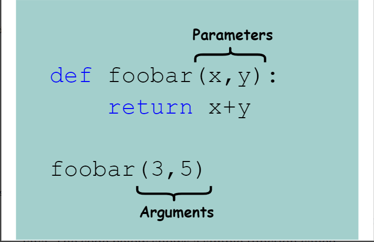

## Functions

A function is a set of statements that take inputs, do some specific computation, and produce output.

There are mainly two advantages of JavaScript functions.

- `Code reusability` : We can call a function several times so it save coding.
- `Less coding` : It makes our program compact. We don’t need to write many lines of code each time to perform a common task.

## Function declaration

A `function definition` (also called a function declaration, or function statement) consists of the function keyword, followed by:

- The name of the function.
- A list of `parameters` to the function, enclosed in parentheses and separated by commas.
- The JavaScript statements that define the function, enclosed in curly brackets, { }.
- For example, the following code defines a simple function named `addNumbers` :

```ts
function addNumbers(a, b) {
  return a + b;
}
```

- The function above, named `addNumbers`, takes in two parameters, `a` and `b` . The code inside the function body simply adds these two parameters together and returns the result.

## Function Expression

- `Function expressions` in JavaScript are similar to regular function declarations. The difference between them is that the function expression is always assigned to a `variable` .
- Such a function can be `anonymous` ; it does not have to have a `name`.
- For example, the function `addNumbers` could have been defined as:

```ts
const addNumbers = function (a, b) {
  return a + b;
};

console.log(1, 2); // prints 3
```

## Arrow Function

- It is one of the most used and efficient methods to create a function in JavaScript because of its comparatively easy implementation.
- It is a simplified as well as a more compact version of a regular or normal function expression or syntax.

Syntax:

```ts
let addNumbers = (a, b) => a + b;
```

## Immediately Invoked Function Expressions (IIFE)

- JavaScript provides a variety of methods to define and execute Functions, there are named functions and anonymous functions, and then there are Functions that are executed as soon as they are mounted, these functions are known as Immediately Invoked Function Expressions or IIFEs.
- `Syntax` : IIFEs follow a particular syntax as shown below.

```ts
(function () {
  // Function Logic Here.
})();
```

- `Immediately Invoked` : This part is easy to explain and demonstrate. This type of function is called immediately invoked as these functions are executed as soon as they are mounted to the stack, it requires no explicit call to invoke the function. If we look at the syntax itself we have two pairs of closed parentheses, the first one contains the logic to be executed and the second one is generally what we include when we invoke a function, the second parenthesis is responsible to tell the compiler that the function expression has to be executed immediately.

## Parameter vs. argument

- A `parameter` is a variable in a function definition. It is a placeholder and hence does not have a concrete value.
- An `argument` is a value passed during function invocation.


