### `Everything in javascript happens inside an Execution Context.`

## Execution Context

It has two components in it.

Execution Context looks like.

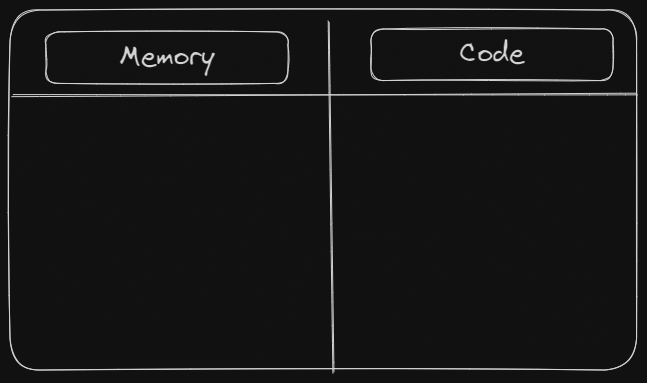

### 1.Memory Component

In this Memory Component all the variables and functions are stored as `key value pairs`.
This Memory Component is also called as `Variable Environment`.

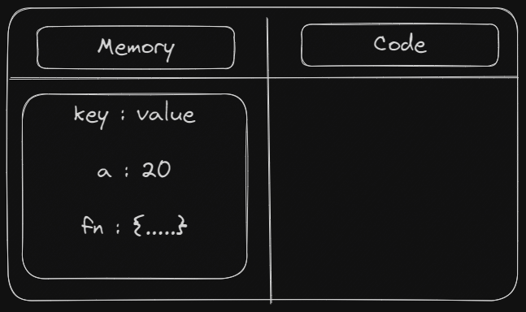

### 2.Code Component

This is the place where the `code is executed one line at a time`.This code component is also called as `Thread of Execution`.

### Example

```
var n=2;
function square(num){
    var ans=num*num;
    return ans;
}
var square2=square(n);
var square4=square(4);
```

When you run this code ,A global execution context is created.

This exection context is created in two phases.

### Creation Phase (or) Memory Creation Phase

During the `Memory Creation phase` in JavaScript, the entire program is traversed, and `memory is allocated for all variables and functions`. This process involves reserving space in memory to store the data associated with variables and the code associated with functions. By doing this, JavaScript prepares the necessary resources to store and manipulate data and to execute the functions when they are called upon during the subsequent code execution phase.

### Execution Phase (or) Code Execution Phase

During the `Code Execution Phase`, JavaScript processes the entire program by executing each line of code. This involves running all `functions` and performing all `calculations` present in the program. In this phase, the program's logic is put into action, and the desired operations are carried out `sequentially`.

At the very beginning, the JavaScript engine executes the entire source code, creates a global execution context, and then does the following things:

1.Sets up a memory for storing variables and functions.

2.Stores the variables with values as undefined and function references.

## Creation Phase

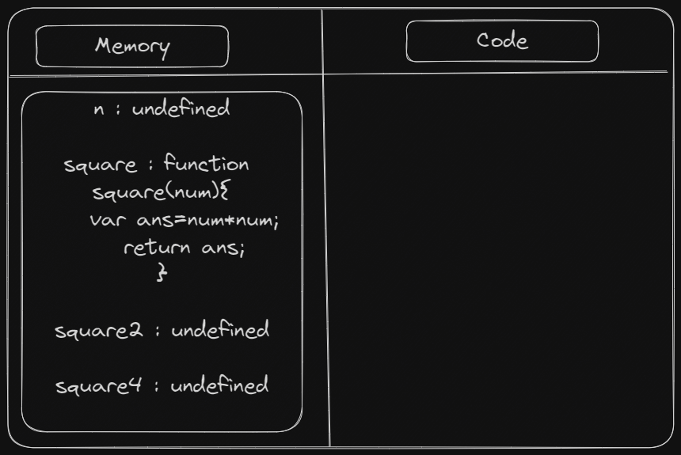

## Execution Phase

Now, in this phase, it starts going through the entire code line by line from top to bottom. As soon as it encounters n = 2, it assigns the value 2 to 'n' in memory. Until now, the value of 'n' was undefined by default.

Then we get to the 'square' function. As the function has been allocated in memory, it directly jumps into the line var square2 = square(n);. square() will be invoked and JavaScript once again will create a new function execution context.

## Creation Phase for square2

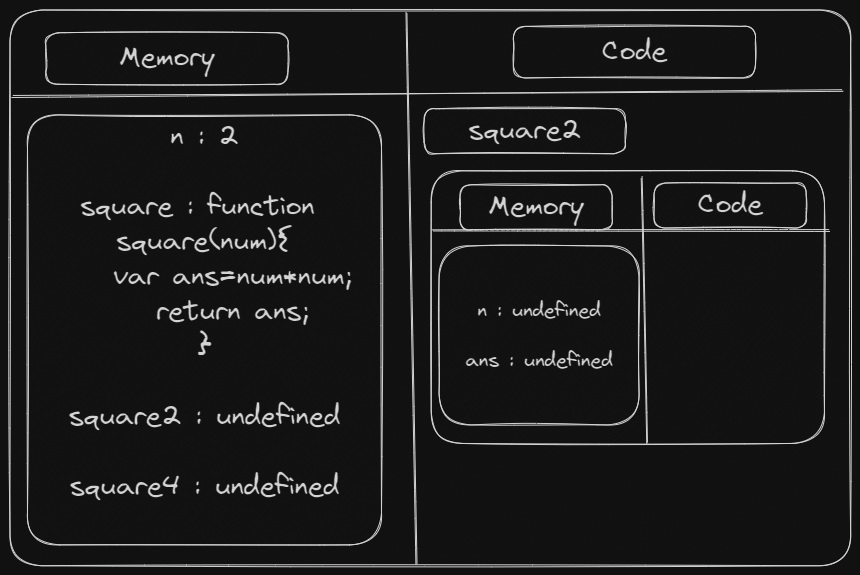

## Execution Phase for square2

Again it runs the entire function of square line by line from top to bottom.As soon as it encounters n=2,it assigns the 2 value to n in memory.

Once the calculation is done, it assigns the value of square in the 'ans' variable that was undefined before.

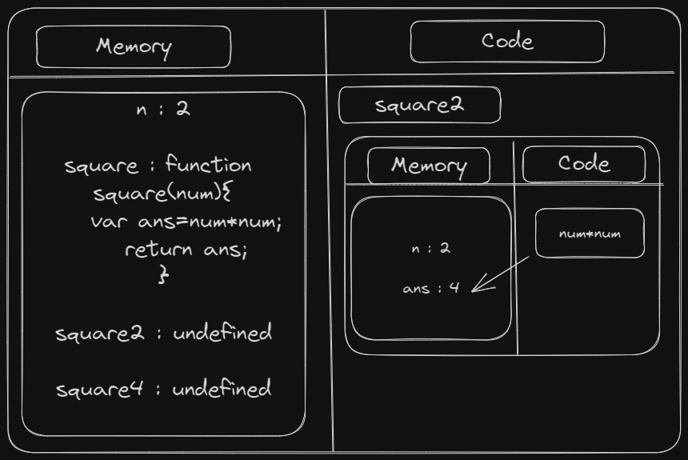

As we can see, the values are assigned in the memory component after executing the code line by line, i.e. number: 2, res: 4, square2: 4.

After the return statement of the invoked function, the returned value is assigned in place of undefined in the memory allocation of the previous execution context.

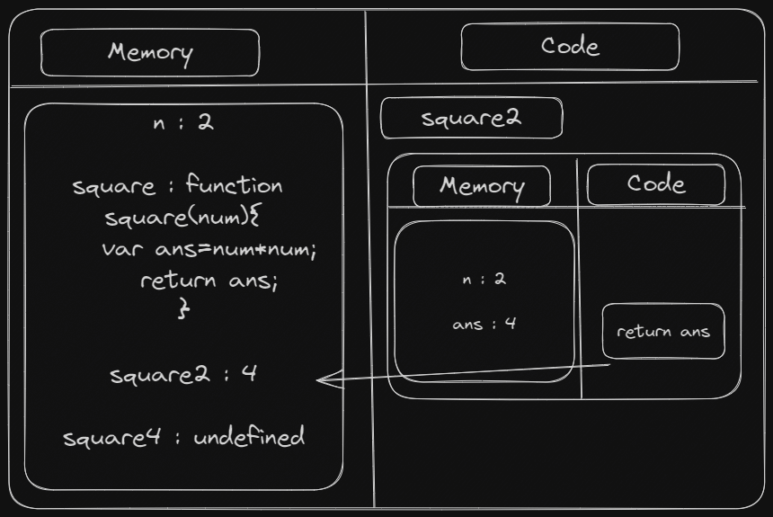

After returning the value, the new execution context (square2) gets completely deleted. Whenever the execution encounters the return statement, It gives the control back to the execution context where the function was invoked.

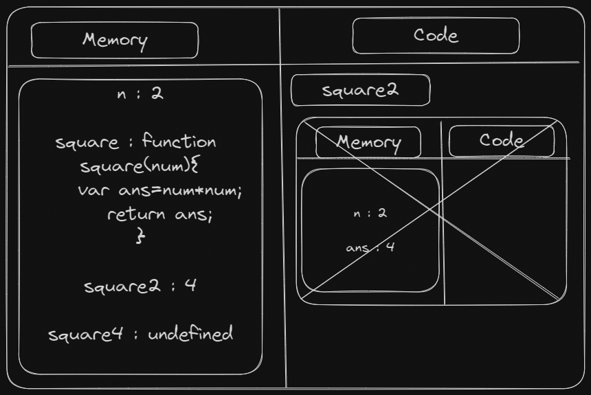

## Creation Phase for square4

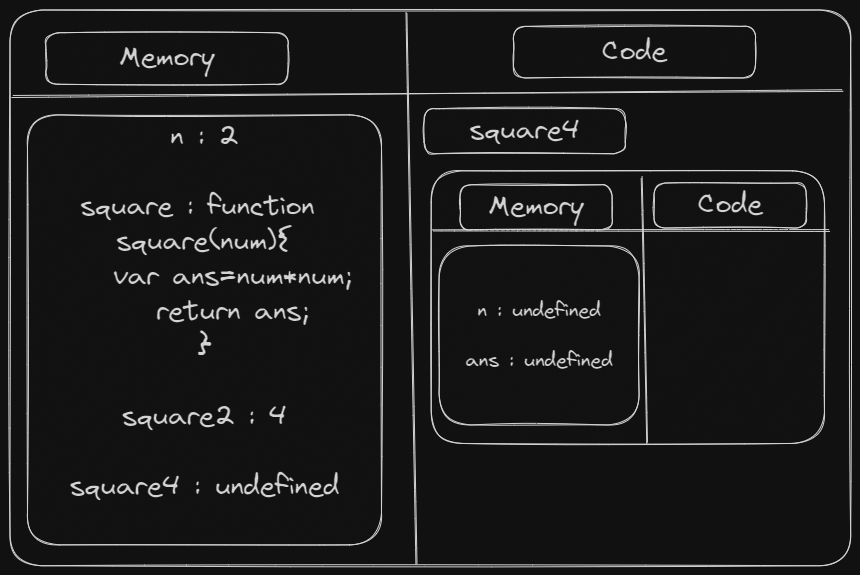

## Execution Phase for square4

Again it runs the entire function of square line by line from top to bottom.As soon as it encounters n=4,it assigns the 4 value to n in memory.

Once the calculation is done, it assigns the value of square in the 'ans' variable that was undefined before.

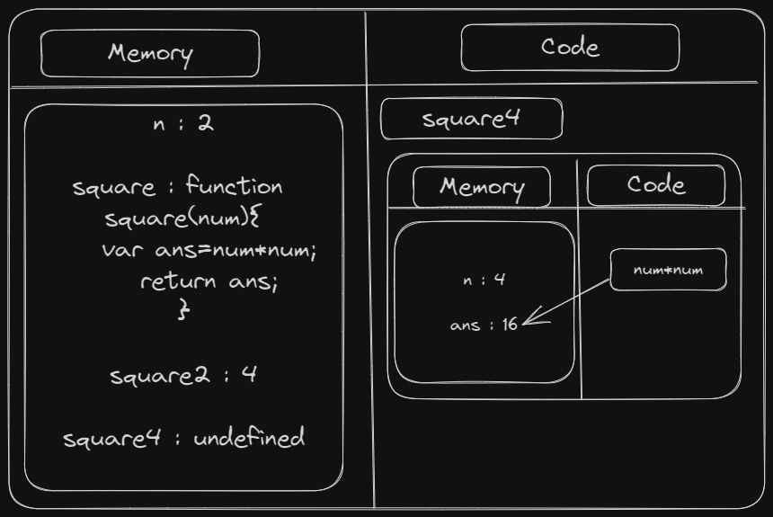

As we can see, the values are assigned in the memory component after executing the code line by line, i.e. number: 4, res: 16, square4: 16.

After the return statement of the invoked function, the returned value is assigned in place of undefined in the memory allocation of the previous execution context.

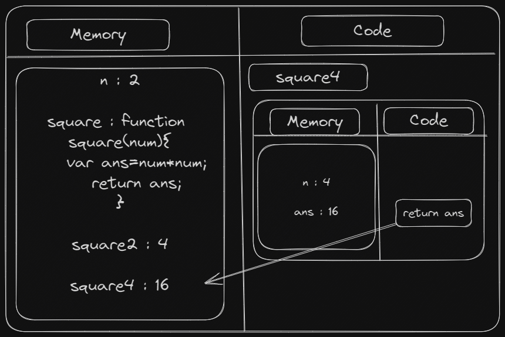

After returning the value, the new execution context (square4) gets completely deleted. Whenever the execution encounters the return statement, It gives the control back to the execution context where the function was invoked.

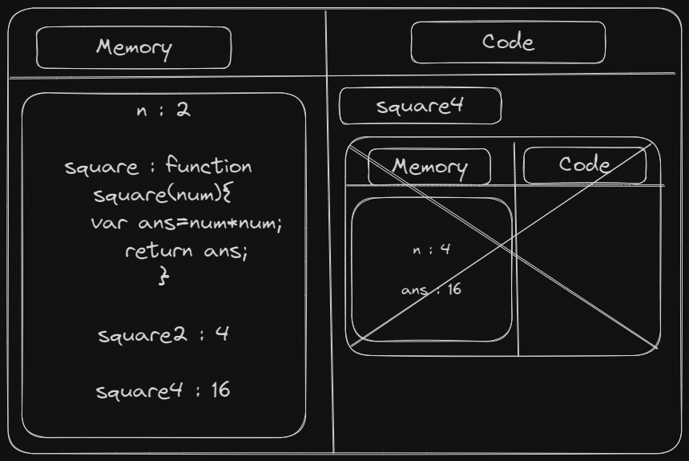

Now the program is finished,there is nothing to execute.Now the whole `Global Execution Context` `deletes`.

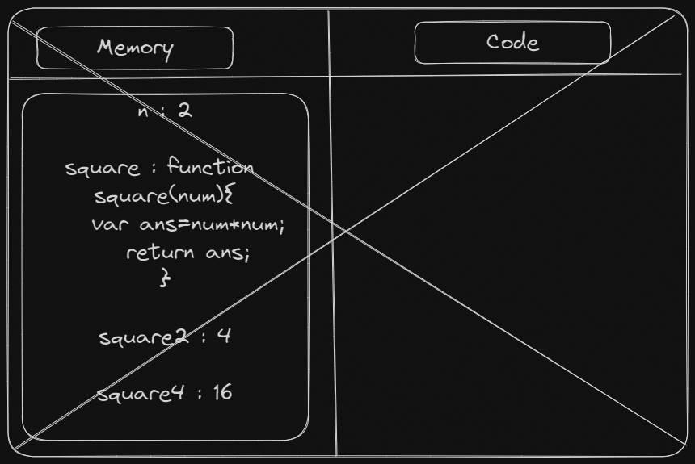

### What is the Call Stack?

To keep the track of all the contexts, including global and functional, the JavaScript engine uses a `call stack`. A call stack is also known as an `Execution Context Stack`, `Runtime Stack`,`Machine Stack`,`Program Stack`,`Control Stack`.

It uses the `LIFO principle (Last-In-First-Out)`. When the engine first starts executing the script, it creates a `global context` and `pushes` it on the stack. Whenever a `function is invoked`, similarly, the JS engine creates a function stack context for the function and pushes it to the `top of the call stack and starts executing it`.

When execution of the `current function is complete`, then the JavaScript engine will automatically `remove the context` from the call stack and it goes back to its parent.

Once execution of each function is done, it will be removed from the call stack.

Let's see the call stack for above example:

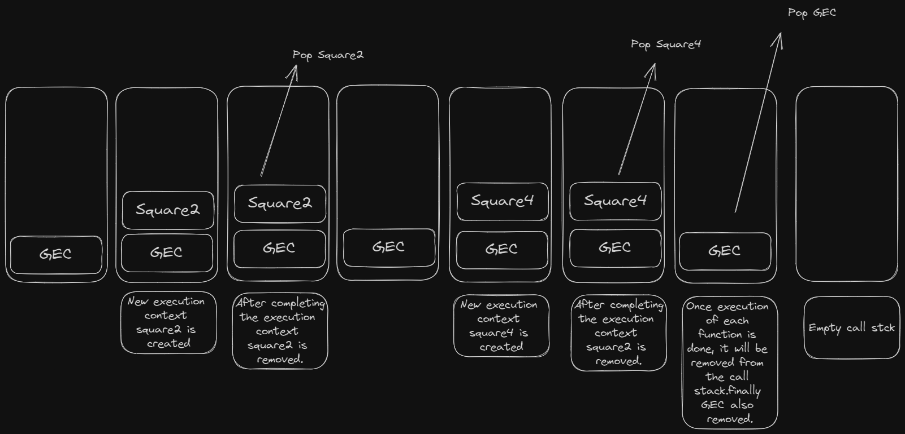
